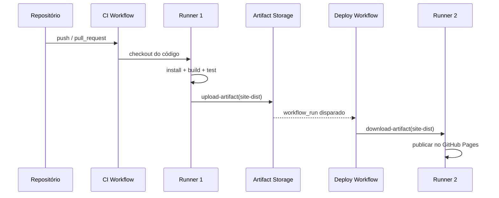

# GitHub Actions: o que acontece no checkout e como os artefactos sobrevivem entre jobs

## 1. O que é um runner

Quando o GitHub Actions executa uma `job`, cria um runner temporário para essa job.

Normalmente é:
- uma VM Linux em ambiente do GitHub
- ou um container do GitHub-hosted runner
- ou um self-hosted runner que tu possas configurar localmente ou numa máquina tua

Esse runner é usado apenas para essa execução.

Não é uma imagem permanente do teu projeto. É um ambiente efémero, criado para correr o job, e normalmente descartado no fim da execução.

---

## 2. O que faz `actions/checkout@v4`

Este passo faz exactamente o seguinte:

1. recebe o código do teu repositório
2. copia o conteúdo para a workspace do runner
3. disponibiliza esse conteúdo para os passos seguintes

Se a workflow tem algo como:

```yaml
steps:
  - uses: actions/checkout@v4
```

então o runner passa a ter o código do repositório no diretório de trabalho do job, normalmente em algo como:

```bash
/home/runner/work/<repo>/<repo>
```

Esse espaço é chamado de workspace do job.

Ele existe apenas durante a execução da job.

---

## 3. O que é descartado e quando

### O que dura apenas enquanto a job corre
- runner
- workspace
- ficheiros criados durante a execução
- node_modules criado pelo npm install
- ficheiros temporários
- outputs intermediários

### Quando desaparecem
- quando a job termina, normalmente o runner é limpo
- o ambiente não é mantido automaticamente para a próxima job

A menos que se faça upload de artefactos.

---

## 4. O que são artefactos

Um artefacto é um conjunto de ficheiros que se quer guardar para além da job atual.

Exemplo:

```yaml
- name: Upload build artifact
  uses: actions/upload-artifact@v4
  with:
    name: site-dist
    path: sampleSite/dist
```

Isto faz o seguinte:

- pega na pasta `sampleSite/dist`
- guarda-a no armazenamento do GitHub Actions
- torna-a disponível para passos futuros

Esse armazenamento é persistente para um período definido pelo GitHub e pode ser usado por:
- outra job da mesma workflow
- outra workflow diferente, via `workflow_run`, `download-artifact`, etc.

É assim que se passa dados entre jobs/workflows sem depender da máquina original.

---

## 5. Como uma segunda action usa o resultado da anterior

Se quiseres encadear duas actions dependentes do resultado da anterior, precisas de guardar um artefacto.

### Exemplo do fluxo:

#### CI workflow
```yaml
- name: Build app
  run: npm run build

- name: Upload build artifact
  uses: actions/upload-artifact@v4
  with:
    name: site-dist
    path: sampleSite/dist
```

#### Deploy workflow
```yaml
- name: Download build artifact
  uses: actions/download-artifact@v4
  with:
    name: site-dist
    path: ./dist
```

Resultado:
- a primeira job produziu ficheiros
- estes foram guardados em artefactos
- a segunda job recebe exatamente esse conteúdo

Sem artefacto, a segunda job não vê os ficheiros, porque o runner anterior foi descartado.

---

## 6. O que acontece entre jobs da mesma workflow

Se tens jobs diferentes na mesma workflow, o GitHub Actions cria um runner novo para cada job, salvo exceção.

Ou seja:

- job A continua com o workspace A
- job B vai ter um runner B, não o mesmo filesystem
- para passar dados entre A e B, usa-se `upload-artifact` + `download-artifact`

---

## 7. O que acontece entre workflows diferentes

Quando tens workflows separadas, o ambiente também não é partilhado automaticamente.

Se queres que uma workflow dependa de outra, usa-se:

- `workflow_run` para disparar uma workflow quando outra termina
- artefactos para transportar os ficheiros

No teu caso actual, a lógica é esta:

```yaml
on:
  workflow_run:
    workflows: ["CI"]
    types: [completed]
```

Isto faz:
- espera pela workflow chamada "CI"
- quando ela termina, dispara esta workflow
- depois verifica se concluiu com sucesso

```yaml
if: ${{ github.event.workflow_run.conclusion == 'success' }}
```

Só então faz deploy.

---

## 8. Resumo simples

### `actions/checkout@v4`
- copia o teu código para o runner
- serve para o build e testes
- só existe durante a job

### `upload-artifact`
- guarda ficheiros para uso posterior
- não depende do runner live

### `download-artifact`
- usa os ficheiros guardados numa job/workflow anterior

### Runner
- é temporário
- é descartado ao fim da execução

### Conclusão
- não há persistência automática da máquina entre jobs
- para encadear ações dependentes, usa artefactos
- `checkout` não é um site persistente nem uma imagem contínua
- é apenas o passo que coloca o repositório no ambiente de execução

---

## 9. No teu caso concreto

O teu pipeline está assim:

1. `ci.yml` faz checkout do repositório
2. instala dependências
3. executa build e testes
4. guarda `sampleSite/dist` em `site-dist`
5. `deploy.yml` dispara quando `CI` termina com sucesso
6. baixa `site-dist`
7. publica esse conteúdo no GitHub Pages

Isso é a forma correta de encadear a validação e a publicação.

---

## 10. Fluxo visual do pipeline

```mermaid
flowchart LR
    A[GitHub Repository] --> B[actions/checkout@v4]
    B --> C[Runner temporário]
    C --> D[npm install]
    D --> E[build + testes]
    E --> F[upload-artifact]
    F --> G[site-dist]
    G --> H[workflow_run / job seguinte]
    H --> I[download-artifact]
    I --> J[Deploy / GitHub Pages]
```



### Em palavras simples

- o código não “permanece” num runner entre execuções
- os ficheiros precisam de ser guardados explicitamente
- o deploy só pode usar o que foi exportado como artefacto
- por isso, o passo de artefacto é a ponte entre a validação e a publicação

---

## 11. Regra prática de memorização

- `checkout` = traz o código para o runner
- `run` = executa comandos no runner
- `upload-artifact` = guarda o que é preciso
- `download-artifact` = recupera o que foi guardado
- runner = ambiente temporário
- artefacto = ponte entre execuções
